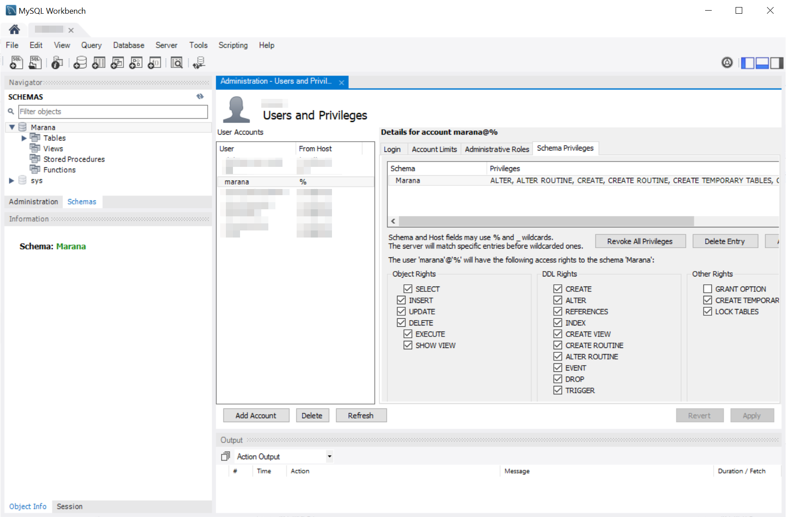
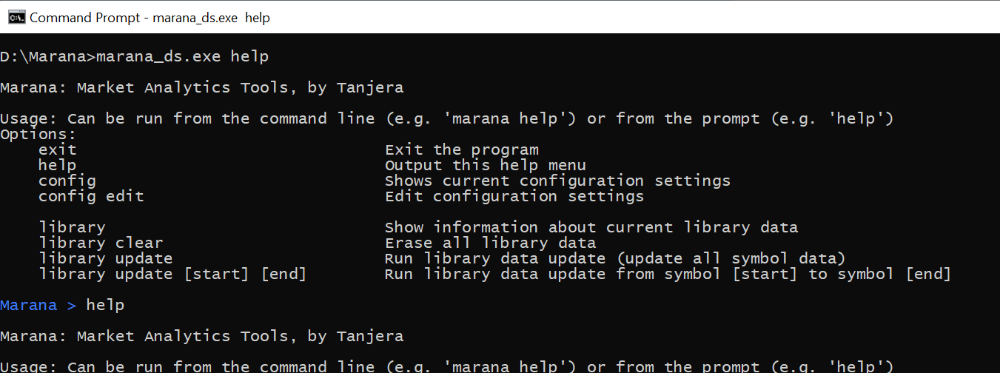
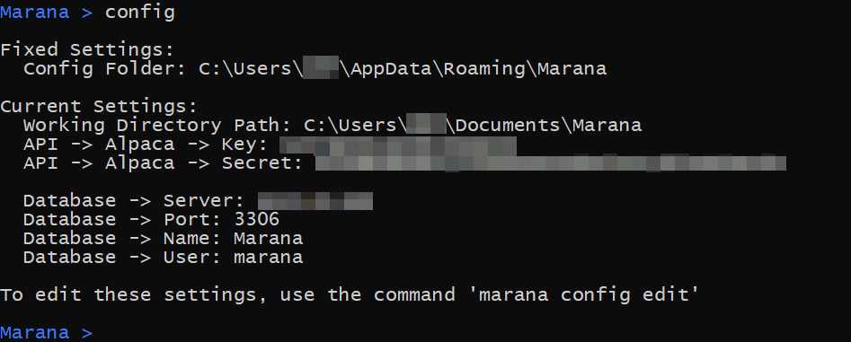
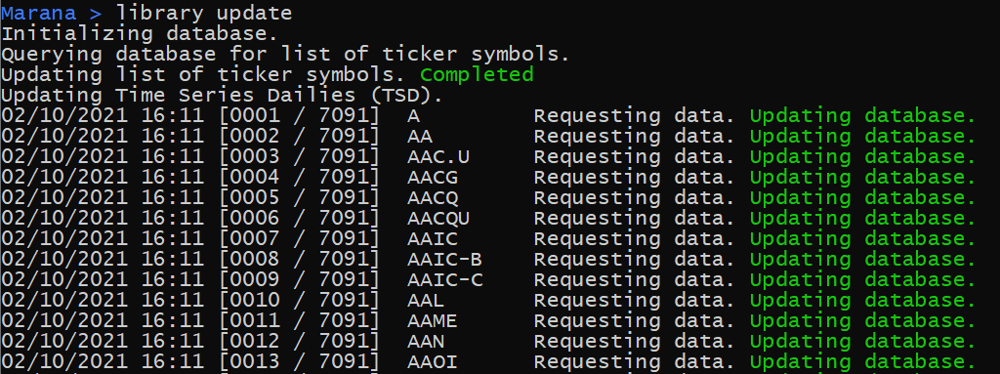

# Marana (Market Technical Analytics and Trading)

Marana is a cross-platform program written in C#/Mono designed to allow retail investors to use technical analysis of market assets in order to inform and conduct market trading, using the [Alpaca](https://alpaca.markets/) platform for market data and [Skender.Stock.Indicators](https://github.com/DaveSkender/Stock.Indicators) for analytics and metrics. Additionally, Marana uses a MySQL database for its storage and handling of data. Since Marana is comprised of free and/or open source software, this allows retail investors to conduct technical analysis of data with minimal financial barriers to entry.

Marana is currently under development. Here are running lists of implemented features and planned features:

### Current, Implemented Features
- Connection to [Alpaca API](https://alpaca.markets/docs/about-us/)'s free service for retrieval of daily market data.
- Retrieves last 300-1000 trading days (~1 yr+) of market data (NASDAQ, NYSE) for all assets
- Uses a command-line interface (CLI) that can be run by OS task scheduling, cron jobs
- Stores all market data in a MySQL database via network connection
  - Raw data can be queried by any SQL interface (e.g. MySQL Workbench)
- Performs technical analysis of all assets, including:
  - Simple Moving Averages (SMA; 7d, 20d, 50d, 100d, 200d)
  - Exponential Moving Averages, Double and Triple (EMA, DEMA, TEMA; 7d, 20d, 50d)
  - Relative Strength Index (RSI)
  - Bollinger Bands®
  - Moving Average Convergence/Divergence (MACD)

### Future, Planned Features
- Additional technical analysis indicators and metrics
- Intra-day market data
- Entry and execution of automated trading strategies, written as SQL queries
- Data analysis targeted to a portfolio

## Instructions for Use
Although Marana aims to reduce barriers to data analysis for retail investors, **using Marana still requires a fair amount of computing skills,** including a minimum ability to use the command prompt, install a MySQL database service, and be able to write basic SQL (database) queries. Although using Marana and its connected services are all free, it is not a turnkey operation.

1) Install a [MySQL Server](https://dev.mysql.com/downloads/mysql/)
   1) The server does not have to be on the same computer that will be running Marana, though it is recommended to be on a LAN or high-speed connection due to speed constraints
   2) It is recommended to use a graphical/GUI interface such as [MySQL Workbench](https://www.mysql.com/products/workbench/) (standalone tool, cross-platform) or [phpMyAdmin](https://www.phpmyadmin.net/) (requires web server)
2) Configure the MySQL Server
   1) Marana requires a database user and password (example username 'marana') to log in to the MySQL server
      1) Note: Marana will store this password *unencrypted* in your `~/.config/Marana` (Linux) or `...\AppData\Roaming\Marana` (Windows) folder (*not* on the database); *it is recommended to use a [randomly generated password](https://www.google.com/search?q=random+password+generator)* for your Marana database user account!!
   2) Marana requires a database schema (database object) that its user has privileges for (requires Object Rights and DDL Rights)
   3) For more information on initial setup of a MySQL server, including obtaining root access, see the official MySQL documentation: ["Getting Started with MySQL"](https://dev.mysql.com/doc/mysql-getting-started/en/)
   
   *"Schema" and "Users and Privileges" view in [MySQL Workbench](https://www.mysql.com/products/workbench/)*
3) Configure Marana via command line interface `marana.exe`
   1) Marana can accept command-line arguments, or can be run with no arguments and take input at the prompt.
   
   *The `help` command being run from the command line, and again from the in-program prompt*
   1) Run the `config edit` option and follow the prompts, entering the appropriate information
      1) If your [Alpaca](https://alpaca.markets/) account uses a Paper (fake money) account, then you must enter the Paper credentials.
   2) You can run the `config` option to verify your settings
    
4) Use Marana (`marana.exe`)
   1) Running `library update` should download data from Alpaca, run analyses, and store the data on the database server.
   2) You can see how large your database library is with the command `library info`
   
   *Marana running a `library update`
   3) For regular data updates, you can create tasks to run `library update` via the [Task Scheduler](https://docs.microsoft.com/en-us/windows/win32/taskschd/about-the-task-scheduler) (Windows) or [cron jobs](https://www.google.com/search?q=linux+cron+task) (Linux)
