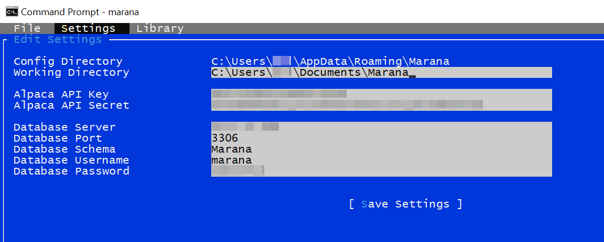
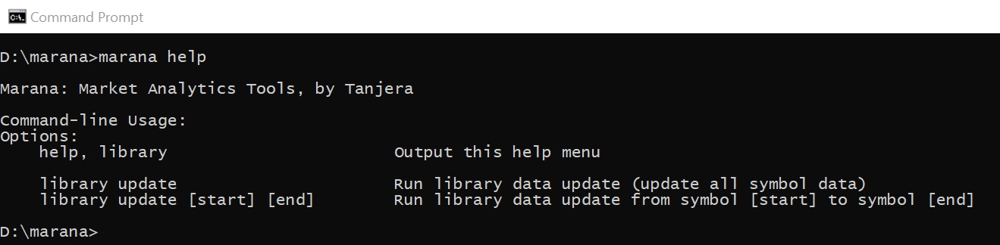

# Marana (Market Technical Analytics and Trading)

Marana is a cross-platform project written in C#/Mono designed to allow retail investors to use technical analysis of market assets in order to inform and conduct market trading, using the [Alpaca](https://alpaca.markets/) and [Alpha Vantage](https://www.alphavantage.co/) platforms for market data and [Skender.Stock.Indicators](https://github.com/DaveSkender/Stock.Indicators) for analytics and metrics. Marana stores and handles cached and calculated data using a MySQL database. Using SQL queries and instruction sets that can be developed by the user and stored in the MySQL database, Marana can execute automated trades using the [Alpaca](https://alpaca.markets/) trading platform.

Since Marana is comprised of free and/or open source software, this allows retail investors to conduct technical analysis of data with minimal financial barriers to entry.


## Warnings
- To quote the distribution license (a.k.a. end-user license agreement), Marana is provided on an "as is" basis "without warranties... [of] fitness for a particular purpose", and "in no event... shall any [developer] be liable to you for damages [(monetary losses)]... out of the use or inability to use the [program]". In other words- use this product at your own risk.
- Marana is still in early stages of development and has not reached a stable version. Unstable versions are subject to feature-breaking changes without notice. Unstable and stable versions may have bugs that cause unexpected failure of the program. In other words- use this product at your own risk.

## Features

Marana is currently under development. Here are running lists of implemented features and planned features:

### Current, Implemented Features
- Data Library management and updating using a variety of options, including data providers:
  - Connection to [Alpaca API](https://alpaca.markets/docs/about-us/)'s free service for retrieval of daily market data.
  - Connection to [Alpha Vantage API](https://www.alphavantage.co/documentation/)'s free service for retrieval of daily market data.
- Retrieves last 300-1000 trading days (~1 yr+) of market data (NASDAQ, NYSE) for assets
  - Can retrieve all market data
  - Can retrieve only symbols specified on a watchlist
- Uses a command-line interface (CLI) that can be run by OS task scheduling, cron jobs
  - Allows for updating data library and executing automated trading on specific intervals
- Stores all market data in a MySQL database via network connection
  - Raw data can be queried by any SQL interface (e.g. MySQL Workbench)
  - Can populate a watchlist to only maintain data for specific symbols
- Performs technical analysis of all assets and stores results in MySQL database, including:
  - Simple Moving Averages (SMA; 7d, 20d, 50d, 100d, 200d)
  - Exponential Moving Averages, Double and Triple (EMA, DEMA, TEMA; 7d, 20d, 50d)
  - Relative Strength Index (RSI)
  - Rate of Change (ROC)
  - Bollinger Bands®
  - Moving Average Convergence/Divergence (MACD)
  - Stochastic Oscillator
  - Choppiness Index
- Execution of automated trading instructions based on pre-defined strategies
  - Strategies in database as sets of SQL queries to determine buy/sell signals
  - Automated trading instructions will buy/sell based on strategy signals
    - Numerous condition checks prevent accidental duplicate orders or margin trading
    - Verbose console output gives transparency to automated results and actions
  - Can validate strategy SQL queries in GUI to ensure no erroneous SQL syntax

### Future, Planned Features
- Graphical interface panes for additional database tasks
- Additional technical analysis indicators and metrics
- Intra-day market data and trading

## Instructions for Use
Although Marana aims to reduce barriers to data analysis for retail investors, **using Marana still requires a fair amount of computing skills, especially writing database queries** including a minimum ability to use the command prompt, install a MySQL database service, and be able to write basic SQL (database) queries. Although using Marana and its connected services are all free, it is not a turnkey operation.

1) Install a [MySQL Server](https://dev.mysql.com/downloads/mysql/)
   1) The server does not have to be on the same computer that will be running Marana, though it is recommended to be on a LAN or high-speed connection due to speed constraints
   2) It is recommended to use a graphical/GUI interface such as [MySQL Workbench](https://www.mysql.com/products/workbench/) (standalone tool, cross-platform) or [phpMyAdmin](https://www.phpmyadmin.net/) (requires web server)
2) Configure the MySQL Server
   1) Marana requires a database user and password (example username 'marana') to log in to the MySQL server
      1) Note: Marana will store this password *unencrypted* in your `~/.config/Marana` (Linux) or `...\AppData\Roaming\Marana` (Windows) folder (*not* on the database); *it is recommended to use a [randomly generated password](https://www.google.com/search?q=random+password+generator)* for your Marana database user account!!
   2) Marana requires a database schema (database object) that its user has privileges for (requires Object Rights and DDL Rights)
   3) For more information on initial setup of a MySQL server, including obtaining root access, see the official MySQL documentation: ["Getting Started with MySQL"](https://dev.mysql.com/doc/mysql-getting-started/en/)
   
   *"Schema" and "Users and Privileges" view in [MySQL Workbench](https://www.mysql.com/products/workbench/)*
3) Run Marana (`marana.exe`) and select "Settings" > "Edit"   
   1) If your [Alpaca](https://alpaca.markets/) account uses a Paper (fake money) account, then you must enter the Paper credentials.
   
   *Editing and viewing user settings from the graphical user interface*
   
4) Use Marana
   1) Marana can be operated from the command-line graphical user interface, or accept arguments from the command line.
   2) Running `marana.exe library update` from the command line will download data from Alpaca, run analyses, and store the data on the database server.
   
   *`marana.exe library update`*
   1) For regular data updates, you can create tasks to run `marana.exe library update` via the [Task Scheduler](https://docs.microsoft.com/en-us/windows/win32/taskschd/about-the-task-scheduler) (Windows) or [cron jobs](https://www.google.com/search?q=linux+cron+task) (Linux)
   2) If you forget the list of command-line arguments, you can run `marana.exe help`
   
   *`marana.exe help`*

5) Access Marana's Data Library
   1) It is recommended to use a graphical interface like [MySQL Workbench](https://www.mysql.com/products/workbench/) for accessing the database
   2) Accessing Marana's MySQL database directly allows you to run queries directly against raw market data, which is useful for:
      1) Screening stocks based on specific values and indicators
      2) Selecting stocks for further research
      3) Developing queries to function as entry and exit queries for automated strategies
   3) Some sample queries include:
      1) Selecting all stocks whose [Moving Average Convergence/Divergence (MACD)](https://www.investopedia.com/terms/m/macd.asp) is over the MACD Signal
         ```
         SELECT             
            today.Symbol,
            today.Date,            
            today.MACD,
            today.MACD_Signal
         FROM
            Marana.Daily today
         WHERE            
            today.Date = CURDATE()
            AND today.MACD > today.MACD_Signal               
         ;
         ```
      2) Selecting all stocks whose [Stochastic Oscillator](https://www.investopedia.com/terms/s/stochasticoscillator.asp) is under 25, a common signal to buy.
         ```
         SELECT             
            today.Symbol,
            today.Date,
            today.Stochastic_Oscillator
         FROM
            Marana.Daily today
         WHERE            
            today.Date = CURDATE()
            AND today.Stochastic_Oscillator < 25               
         ;

         ```